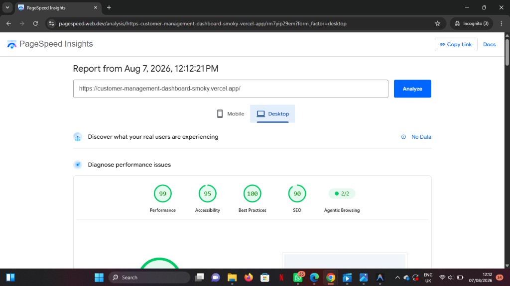
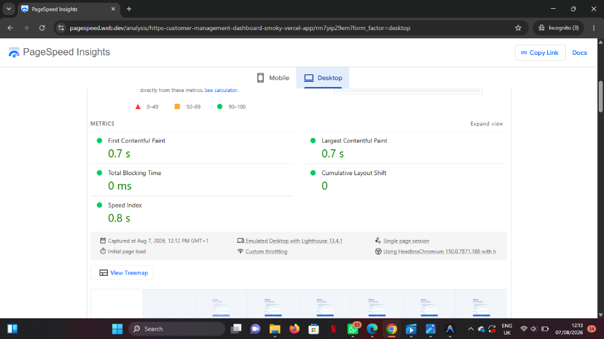

# Customer Management Dashboard — Technical Documentation

## 1. Setup Instructions

This application is built with **React 19** and **Vite 6**.

### Prerequisites

* Node.js `v18.0.0` or later
* npm `v9.0.0` or later

### Installation & Quick Start

1. **Clone the repository:**
   ```bash
   git clone https://github.com/Wsalaudeen/customer-management-dashboard.git
   cd customer-management-dashboard/dashboard-frontend
   ```

2. **Install dependencies:**
   ```bash
   npm install
   ```

3. **Start the development server:**
   ```bash
   npm run dev
   ```
   Open `http://localhost:5173` in your browser.

4. **Run the test suite:**
   ```bash
   npm run test
   ```
   To run tests with code coverage:
   ```bash
   npm run test:coverage
   ```

### Environment Variables

No environment variables are required. The application currently runs with client-side state and mock data.

### Available Commands

| Command                 | Purpose                                               |
| :---------------------- | :---------------------------------------------------- |
| `npm run dev`           | Starts the Vite development server with HMR.          |
| `npm run build`         | Creates a production build in `dist/`.                |
| `npm run preview`       | Serves the production build locally for verification. |
| `npm run test`          | Runs the Vitest test suite once.                      |
| `npm run test:watch`    | Runs Vitest in watch mode.                            |
| `npm run test:coverage` | Runs tests and generates a coverage report.           |
| `npm run lint`          | Runs ESLint across the project.                       |

---

## 2. Assumptions

The current implementation is a frontend-only assessment without a production backend. The following assumptions define the behavior of the application.

### Authentication

* Authentication is simulated on the client using the provided demo credentials.
* The demo credentials are:

  * Email: `admin@peerless.com`
  * Password: `password123`
* Authentication includes simulated asynchronous latency to represent a real authentication request.
* Authentication state exists only during the current application session.

### Customer Data

* Customer records are initialized from the mock dataset in `src/constants/mockCustomers.js`.
* Customer creation and deletion are handled in client-side state.
* Changes remain available during the current React session but are reset when the page is reloaded.
* No external API or persistent database is currently connected.

### Duplicate Customer Detection

Duplicate detection is performed on the client before a customer is created.

The comparison normalizes:

* **Business name** — case, whitespace, and common corporate suffixes are normalized.
* **Email** — compared case-insensitively after trimming.
* **Phone number** — numeric characters are normalized to account for common formatting and country-prefix differences.

When a duplicate is detected:

* Registration is prevented.
* The relevant field is identified where applicable.
* An accessible alert is displayed.
* The user's entered data is preserved so it can be reviewed or corrected.

### Registration Drawer

Customer registration is implemented as a right-side drawer rather than a separate route.

The drawer supports:

* Slide-in and slide-out transitions.
* Backdrop interaction.
* Body scroll locking while open.
* `Escape` to close.
* Keyboard focus trapping.
* Focus restoration to the element that opened the drawer.

After successful registration, the drawer displays a confirmation state containing the newly assigned customer information.

### Dashboard Behavior

The dashboard operates on the current customer state and derives its displayed data through client-side filtering, sorting, and pagination.

The current implementation supports:

* Customer search.
* Status filtering.
* Industry filtering.
* Column sorting.
* Pagination.
* Loading, empty, and populated states.
* Clearing active filters.
* Customer registration and deletion.

### Accessibility

Accessibility is treated as part of the component implementation rather than as a separate enhancement.

The application uses:

* Semantic HTML landmarks.
* Native interactive elements where possible.
* Explicit form labels.
* Logical keyboard navigation.
* Visible focus states.
* Focus management for the registration drawer.
* Appropriate ARIA attributes and live regions.
* Accessible table sorting indicators.
* Accessible labels for icon-only actions.

The implementation targets **WCAG 2.2 AA** practices relevant to the implemented interface.

---

## 3. Architecture Notes

The application is organized around feature-focused components, reusable UI primitives, and custom hooks that isolate stateful logic.

```text
src/
├── components/
│   ├── auth/           # Login-related components
│   ├── customer/       # Customer table, filters, and loading states
│   ├── dashboard/      # Dashboard layout and orchestration
│   ├── header/         # Dashboard header components
│   ├── modal/          # Customer registration drawer and views
│   ├── pagination/     # Pagination controls
│   ├── sidebar/        # Dashboard navigation
│   ├── stats/          # Dashboard metric cards
│   └── ui/             # Reusable UI primitives
├── constants/          # Mock data and application constants
├── hooks/
│   ├── auth/           # Authentication-related hooks
│   ├── dashboard/      # Dashboard state and data-processing hooks
│   └── modal/          # Registration drawer and form hooks
├── test/               # Vitest configuration and test setup
└── utils/              # Shared utilities and duplicate detection
```

### Data Processing

Dashboard data follows a predictable processing pipeline:

```text
Customer State
     ↓
Filtering
     ↓
Sorting
     ↓
Pagination
     ↓
Rendered Table
```

This responsibility is separated into custom hooks rather than being implemented directly inside the dashboard component.

* `useCustomerFilter` handles search, status, and industry filtering.
* `useCustomerSort` manages sort state and comparison logic.
* `useCustomerPagination` manages page state and pagination boundaries.
* `useCustomerMetrics` derives dashboard statistics.
* `useDashboard` coordinates the dashboard-level state and data flow.

This keeps the main dashboard component focused on composition rather than data-processing logic.

### Registration Drawer

The registration flow is isolated from the dashboard through dedicated components and hooks.

`useModalDrawer` handles drawer-specific behavior such as:

* Mounting and transition state.
* Keyboard interaction.
* Focus trapping.
* Focus restoration.
* Closing behavior.

The registration form and success state are kept separate so that each view has a focused responsibility.

### Styling

The project uses CSS Modules for component-level styles and CSS Custom Properties for shared design tokens.

Global tokens are defined in `src/index.css` and cover shared values such as:

* Colors
* Typography
* Spacing
* Border radii
* Shadows
* Transitions

This provides consistency across components while keeping component styles scoped.

### Component Communication

The application follows unidirectional data flow.

Parent components own relevant state and pass data and callbacks to child components through props.

For example:

```text
Dashboard
   ├── CustomerSection
   │      ├── FilterToolbar
   │      └── CustomerTable
   │
   └── RegisterCustomerModal
```

User interactions are communicated upward through callback props, while derived state and display data flow downward.

---

## 4. Engineering Trade-offs

| Decision                     | Implemented                                    | Alternative                                      | Reasoning                                                                                                                                                        | Trade-off                                                                                             |
| :--------------------------- | :--------------------------------------------- | :----------------------------------------------- | :--------------------------------------------------------------------------------------------------------------------------------------------------------------- | :---------------------------------------------------------------------------------------------------- |
| **Application architecture** | React + Vite                                   | Next.js                                          | The application is an authenticated internal dashboard and does not require server-side rendering or SEO. Vite provides a straightforward client-side setup.     | Initial rendering depends on client-side JavaScript.                                                  |
| **Server state**             | React state + custom hooks                     | TanStack Query / SWR                             | The assessment uses mock data rather than a remote API, so a server-state library would add complexity without providing significant value in the current scope. | API caching, refetching, and mutation management would need to be added when a backend is introduced. |
| **State management**         | React state and custom hooks                   | Redux Toolkit / Zustand                          | The current application has a relatively small state surface and does not require a dedicated global state library.                                              | A larger application with deeply shared state may benefit from a dedicated state-management solution. |
| **Styling**                  | CSS Modules + CSS Custom Properties            | Tailwind CSS / component library                 | CSS Modules provide scoped component styles while CSS variables provide shared design tokens without introducing another styling framework.                      | More styling decisions and CSS are maintained manually.                                               |
| **Navigation**               | Application state between Login and Dashboard  | React Router                                     | The current application has only two application views and does not require URL-based routing.                                                                   | There are no dedicated URLs or browser history navigation for application views.                      |
| **Data operations**          | Client-side filtering, sorting, and pagination | Server-side data operations                      | The mock dataset is small enough for client-side processing and this keeps the implementation simple within the assessment scope.                                | Server-side operations will be required as the dataset grows.                                         |
| **Duplicate detection**      | Client-side normalized comparison              | Server-side validation with database constraints | Client-side validation provides immediate feedback within the current frontend-only implementation.                                                              | It cannot guarantee uniqueness across multiple users or concurrent requests.                          |
| **Testing**                  | Vitest + React Testing Library                 | Browser-based E2E testing                        | Component and unit tests provide fast feedback for the current scope without introducing browser automation infrastructure.                                      | Full user journeys across a real browser are not covered.                                             |

---

## 5. Deferred Work

The following work was intentionally deferred because it requires backend infrastructure, production services, or additional scope beyond the current frontend assessment.

### 1. Production Authentication and Session Management

**Current implementation**

Authentication is simulated on the client using demo credentials and simulated request latency.

**Deferred**

Integration with a production authentication service and persistent session management.

**Why**

The assessment does not provide an authentication backend.

**Future work**

* Integrate with the application's identity provider or authentication API.
* Handle access and refresh tokens using an appropriate secure strategy.
* Handle session expiration and authentication failures.
* Protect authenticated application views.

**Priority:** High

---

### 2. Persistent Customer API

**Current implementation**

Customer records are maintained in client-side React state and initialized from mock data.

**Deferred**

Persisting customer creation, updates, and deletion through a backend API and database.

**Why**

There is currently no backend service available.

**Future work**

* Define customer API contracts.
* Connect registration and customer operations to the API.
* Handle loading, success, and API error states.
* Persist customer records in a database.

**Priority:** High

---

### 3. Server-Side Data Operations and Duplicate Validation

**Current implementation**

Search, filtering, sorting, pagination, and duplicate detection operate against the client-side dataset.

**Deferred**

Moving these operations to the backend and database.

**Why**

The current dataset is small and local, making client-side processing appropriate for the assessment.

**Future work**

* Support server-side search, filtering, sorting, and pagination.
* Add database indexes for frequently queried fields.
* Enforce uniqueness at the database/API level.
* Return an appropriate conflict response when a duplicate is detected.
* Handle concurrent customer creation safely.

**Priority:** High

---

### 4. Role-Based Access Control

**Current implementation**

The application operates with a single authenticated administrative context.

**Deferred**

Fine-grained permissions for different user roles such as Relationship Managers, Administrators, and Read-Only users.

**Why**

The current requirements do not define multiple permission levels.

**Future work**

* Define roles and permissions.
* Enforce authorization on the backend.
* Reflect permissions in the UI by conditionally exposing actions.
* Prevent unauthorized operations at the API level.

**Priority:** Medium

---

### 5. Production Observability

**Current implementation**

The application provides local error and loading states appropriate for the current frontend scope.

**Deferred**

Production error monitoring, logging, and telemetry.

**Why**

These concerns become relevant when the application is deployed and serving real users.

**Future work**

* Add frontend error monitoring.
* Introduce an application-level error boundary.
* Capture relevant operational errors.
* Add telemetry for important user and system events.

**Priority:** Medium

---

### 6. End-to-End Browser Testing

**Current implementation**

The project uses Vitest and React Testing Library for unit and component-level testing.

**Deferred**

Full browser-based end-to-end testing.

**Why**

The current test setup provides fast coverage of component behavior and user interactions without introducing browser automation infrastructure.

**Future work**

Introduce a tool such as Playwright to validate complete workflows in a real browser, including:

* Login.
* Dashboard access.
* Customer registration.
* Duplicate customer handling.
* Customer deletion.
* Keyboard navigation.
* Drawer focus management.

**Priority:** Medium

---

## 6. Performance

### Lighthouse / Web Vitals

The deployed dashboard was evaluated using Lighthouse, with the following observed results.





| Metric | Measured | Target | Status |
| :--- | ---: | ---: | :--- |
| LCP | 0.7 s | ≤ 2.5s | Good |
| FCP | 0.7 s | ≤ 1.8s | Good |

#### Additional Lighthouse Metrics & Category Scores (Desktop)

| Category / Metric | Score / Measurement | Status |
| :--- | ---: | :--- |
| Performance | 99 / 100 | Good |
| Accessibility | 95 / 100 | Good |
| Best Practices | 100 / 100 | Good |
| SEO | 90 / 100 | Good |
| Total Blocking Time (TBT) | 0 ms | Good |
| Cumulative Layout Shift (CLS) | 0 | Good |
| Speed Index | 0.8 s | Good |

### Reference thresholds

| Metric | Good | Needs Improvement | Poor |
| :--- | ---: | ---: | ---: |
| LCP (Largest Contentful Paint) | ≤ 2.5s | 2.5–4.0s | > 4.0s |
| FCP (First Contentful Paint) | ≤ 1.8s | 1.8–3.0s | > 3.0s |

### Performance considerations

The following implementation choices contributed to the observed performance:

* **Vite production build:** Optimized asset bundling and tree-shaking minimize JavaScript bundle size.
* **Minimal runtime dependencies:** Built with React 19 and Vite 6 without heavy external UI or state framework overhead.
* **Client-side rendering:** Well suited for an authenticated internal dashboard requiring instant interactive feedback.
* **Component-level CSS Modules:** Scoped styling prevents CSS bloat and runtime CSS-in-JS evaluation overhead.
* **Memoized data operations:** Derived operations (search filtering, sorting, pagination, and KPI stats calculations) are memoized via React `useMemo` to eliminate unnecessary computations.
* **Skeleton loading states:** Dedicated skeleton components maintain visual layout stability and prevent Cumulative Layout Shift (CLS).
* **Lightweight state architecture:** Managed through targeted React hooks without global state overhead.

### Measurement context

The measurements were taken against the live deployed version of the dashboard (`https://customer-management-dashboard-smoky-vercel.app/`) using PageSpeed Insights / Lighthouse 13.4.1 under the Desktop form factor on August 7, 2026.
